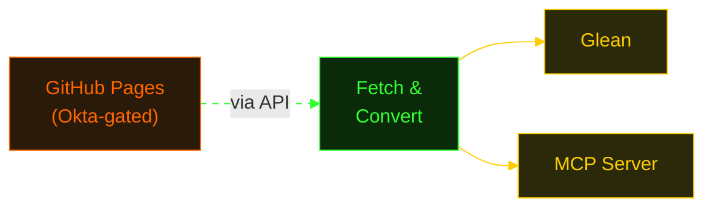

<div class="flex flex-col items-center justify-center h-full">
  <div class="text-green-400 text-sm mb-4 opacity-60 tracking-widest">COREWEAVE HACKATHON 2026</div>
  <h1 class="!text-5xl !font-semibold title-glow">GitHub Pages to Glean</h1>
  <p class="text-lg mt-4 opacity-80">Making internal docs findable by humans <strong>and</strong> AI</p>
  <div class="mt-10 text-sm opacity-50">
    Robin H. Johnson & Audrey Zheng
  </div>
</div>

<style>
:root {
  --slidev-theme-primary: #33ff33;
}
.slidev-layout {
  background: #0c0c0c;
  color: #33ff33;
  font-family: 'IBM Plex Mono', monospace;
  text-shadow: 0 0 8px rgba(51,255,51,0.3);
}
h1 {
  font-weight: 600;
  color: #33ff33;
}
h2 { color: #ffcc00; }
h2::before { content: '> '; opacity: 0.6; }
code {
  background: #0c0c0c;
  color: #33ff33;
  border: 1px solid rgba(51,255,51,0.3);
  border-radius: 0;
  padding: 0.8em 1em;
}
a { color: #ffcc00; text-decoration: underline; }
blockquote { border-left: 3px solid #33ff33; padding-left: 1em; }
strong { color: #ffcc00; }
li { margin-bottom: 0.5em; }
li::marker { color: #33ff33; }
.title-glow {
  text-shadow: 0 0 20px rgba(51,255,51,0.6), 0 0 60px rgba(51,255,51,0.2);
}
@keyframes blink { 0%,100% { opacity: 1; } 50% { opacity: 0; } }
.slidev-page-1 h1::after {
  content: '█';
  animation: blink 1s step-end infinite;
  margin-left: 0.1em;
}
</style>

---

## The Problem

<div class="mt-4 space-y-6">

<div>
  <p class="!text-sm !font-semibold" style="color: #ff6600;">30+ GitHub Pages doc sites across the org</p>
  <p class="opacity-60 !text-xs mt-1">Runbooks, API references, CI/CD workflows, onboarding guides — scattered everywhere</p>
</div>

<div>
  <p class="!text-sm !font-semibold" style="color: #ff6600;">Locked behind GitHub + Okta auth walls</p>
  <p class="opacity-60 !text-xs mt-1">Glean's crawler stalls at the login page. So does every MCP tool and AI agent.</p>
</div>

<div>
  <p class="!text-sm !font-semibold" style="color: #ff6600;">Invisible to Glean search and AI assistants</p>
  <p class="opacity-60 !text-xs mt-1">The docs exist — but nobody can find them when they need them</p>
</div>

<div>
  <p class="!text-sm !font-semibold" style="color: #ff6600;">"Hey, does anyone know where the network docs are?"</p>
  <p class="opacity-60 !text-xs mt-1">Every question becomes a Slack thread, a context switch, and a wait</p>
</div>

</div>

---

## The Solution

<div class="mt-2">

<p class="opacity-80 !text-xs">Crawlers can't get past the Okta login wall — but the GitHub API can. We authenticate with a token, pull every Pages site's content through the API, convert the HTML to clean plaintext, and re-index it into two search surfaces:</p>

</div>

<div class="mt-4 flex justify-center">



</div>

<div class="grid grid-cols-2 gap-6 mt-6">

<div class="border border-green-900 p-3">
  <p class="text-yellow-400 !text-sm !font-semibold">Glean — for humans</p>
  <p class="opacity-80 !text-xs mt-2">Docs appear in Glean search and Glean AI alongside Slack, Confluence, and code</p>
</div>

<div class="border border-green-900 p-3">
  <p class="text-yellow-400 !text-sm !font-semibold">MCP Server — for AI</p>
  <p class="opacity-80 !text-xs mt-2">Claude, Cursor, or any MCP client can query the same docs — no browser needed</p>
</div>

</div>

---

## The MCP Connector

<div class="mt-2">

<p class="opacity-80 !text-xs">The MCP server exposes indexed docs as tools any AI assistant can call:</p>

</div>

<div class="grid grid-cols-3 gap-4 mt-4">
<div class="border border-green-900 p-3">
  <p class="text-yellow-400 !text-sm !font-semibold">search_documents</p>
  <p class="opacity-60 !text-xs mt-1">Full-text keyword search across all indexed pages</p>
</div>
<div class="border border-green-900 p-3">
  <p class="text-yellow-400 !text-sm !font-semibold">list_documents</p>
  <p class="opacity-60 !text-xs mt-1">Browse by repo with pagination and filtering</p>
</div>
<div class="border border-green-900 p-3">
  <p class="text-yellow-400 !text-sm !font-semibold">get_document</p>
  <p class="opacity-60 !text-xs mt-1">Fetch a single doc by ID with full plaintext body</p>
</div>
</div>

<div class="mt-4 grid grid-cols-3 gap-3">

<div>
  <p class="text-yellow-400 !text-xs !font-semibold mb-1">Standalone</p>
  <p class="opacity-50 !text-xs mb-2">Start the server directly</p>

```
$ uv run hackathon mcp-server \
    --docs-file glean_docs.json
```

</div>

<div>
  <p class="text-yellow-400 !text-xs !font-semibold mb-1">Claude Desktop</p>
  <p class="opacity-50 !text-xs mb-2">claude_desktop_config.json</p>

```json
{ "mcpServers": { "ghpages": {
  "command": "uv",
  "args": ["run", "hackathon",
    "mcp-server"]
}}}
```

</div>

<div>
  <p class="text-yellow-400 !text-xs !font-semibold mb-1">Claude Code</p>
  <p class="opacity-50 !text-xs mb-2">~/.claude.json</p>

```json
{ "mcpServers": { "ghpages": {
  "command": "uv",
  "args": ["run", "hackathon",
    "mcp-server"]
}}}
```

</div>

</div>

---
layout: default
---

## What It Feels Like

<div class="grid grid-cols-2 gap-6 mt-2">

<div>
  <p style="color: #ff6600;" class="!font-semibold !text-sm mb-2">Before</p>
  <div style="border: 1px solid #cc5500;" class="p-3 space-y-2">
    <p class="!text-xs opacity-80"><span style="color: #ff6600;">@eng:</span> Does anyone know where the network peering docs live?</p>
    <p class="!text-xs opacity-80"><span style="color: #ff6600;">@infra:</span> Maybe try the wiki? Or was it a GH Pages site?</p>
    <p class="!text-xs opacity-80"><span style="color: #ff6600;">@eng:</span> I found something but it's behind Okta and I can't get in</p>
    <p class="!text-xs opacity-80"><span style="color: #ff6600;">@infra:</span> Let me dig through my bookmarks...</p>
    <p class="!text-xs mt-2" style="color: #ff6600;">[ 45 minutes later ]</p>
  </div>
</div>

<div>
  <p style="color: #22c55e;" class="!font-semibold !text-sm mb-2">After</p>
  <div style="border: 1px solid #1a9a4a;" class="p-3 space-y-2">
    <p class="!text-xs opacity-80"><span class="text-yellow-400">user:</span> What are CoreWeave's network peering docs?</p>
    <p class="!text-xs opacity-80"><span style="color: #22c55e;">claude:</span> Searching GitHub Pages...</p>
    <p class="!text-xs"><span style="color: #22c55e;">tool:</span> search_documents("network peering")</p>
    <p class="!text-xs opacity-80"><span style="color: #22c55e;">claude:</span> Found 3 relevant pages from <strong>coreweave/network-docs</strong>:</p>
    <p class="!text-xs text-yellow-400 mt-1">→ "BGP Peering Configuration Guide"</p>
    <p class="!text-xs text-yellow-400">→ "Network Architecture Overview"</p>
    <p class="!text-xs text-yellow-400">→ "Peering Request Runbook"</p>
    <p class="!text-xs mt-2" style="color: #22c55e;">[ 3 seconds ]</p>
  </div>
</div>

</div>

---

<div class="flex flex-col items-center h-full pt-4">

<h2 class="mb-2">Demo</h2>


</div>

---

<div class="flex flex-col items-center justify-center h-full">

<h2 class="!text-3xl mb-8">Impact</h2>

<div class="grid grid-cols-3 gap-8 mb-10">
  <div class="text-center border border-green-900 p-4">
    <p class="text-yellow-400 !text-3xl !font-semibold">30+</p>
    <p class="opacity-60 !text-xs mt-1">Repos of documentation</p>
  </div>
  <div class="text-center border border-green-900 p-4">
    <p class="text-yellow-400 !text-3xl !font-semibold">1,400+</p>
    <p class="opacity-60 !text-xs mt-1">Documents converted to date</p>
  </div>
  <div class="text-center border border-green-900 p-4">
    <p class="text-yellow-400 !text-3xl !font-semibold">2</p>
    <p class="opacity-60 !text-xs mt-1">Search channels (Glean + MCP)</p>
  </div>
</div>

<div class="text-center mb-8 opacity-80">
  <p><strong>What's next:</strong> scheduled pipeline runs, more datasources, richer metadata</p>
</div>

<div class="text-center text-sm">
  <p class="opacity-60 !text-xs">Try it out or follow our progress:</p>
  <p class="!text-xs mt-1" style="color: #22c55e;">github.com/coreweave/glean-gh-pages</p>
  <p class="mt-6 opacity-40">thank you</p>
  <p class="mt-2 text-yellow-400 opacity-40">$ exit 0</p>
</div>

</div>
