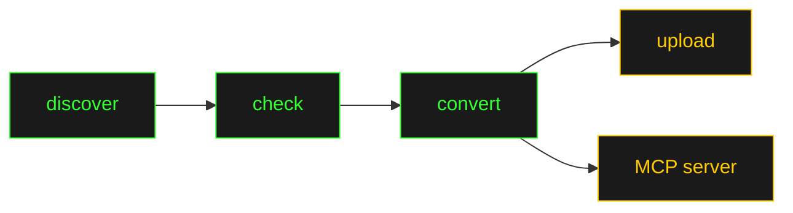

<div class="flex flex-col items-center justify-center h-full">
  <div class="text-green-400 text-sm mb-4 opacity-60 tracking-widest">COREWEAVE HACKATHON 2026</div>
  <h1 class="!text-5xl !font-semibold title-glow">glean-gh-pages</h1>
  <p class="text-lg mt-6 opacity-80">Making internal docs findable by humans <strong>and</strong> AI</p>
  <div class="mt-12 text-sm opacity-40">
    <span class="text-yellow-400">$</span> uv run hackathon mcp-server --docs-file glean_docs.json
  </div>
</div>

<style>
:root {
  --slidev-theme-primary: #33ff33;
}
.slidev-layout {
  background: #0c0c0c;
  color: #33ff33;
  font-family: 'IBM Plex Mono', monospace;
  text-shadow: 0 0 8px rgba(51,255,51,0.3);
}
h1 {
  font-weight: 600;
  color: #33ff33;
}
h2 { color: #ffcc00; }
h2::before { content: '> '; opacity: 0.6; }
code {
  background: #0c0c0c;
  color: #33ff33;
  border: 1px solid rgba(51,255,51,0.3);
  border-radius: 0;
  padding: 0.8em 1em;
}
a { color: #ffcc00; text-decoration: underline; }
blockquote { border-left: 3px solid #33ff33; padding-left: 1em; }
strong { color: #ffcc00; }
li { margin-bottom: 0.5em; }
li::marker { color: #33ff33; }
.title-glow {
  text-shadow: 0 0 20px rgba(51,255,51,0.6), 0 0 60px rgba(51,255,51,0.2);
}
@keyframes blink { 0%,100% { opacity: 1; } 50% { opacity: 0; } }
.slidev-page-1 h1::after {
  content: '█';
  animation: blink 1s step-end infinite;
  margin-left: 0.1em;
}
</style>

---

## The Problem

<div class="mt-8 space-y-6">

<div class="flex items-start gap-3">
  <span class="text-red-400 text-xl">x</span>
  <div>
    <p class="!text-lg !font-semibold text-red-400">100+ GitHub Pages sites across the org</p>
    <p class="opacity-60 text-sm">Docs, runbooks, API references, architecture guides — scattered everywhere</p>
  </div>
</div>

<div class="flex items-start gap-3">
  <span class="text-red-400 text-xl">x</span>
  <div>
    <p class="!text-lg !font-semibold text-red-400">Many are behind Okta auth walls</p>
    <p class="opacity-60 text-sm">Standard crawlers and search engines can't reach them</p>
  </div>
</div>

<div class="flex items-start gap-3">
  <span class="text-red-400 text-xl">x</span>
  <div>
    <p class="!text-lg !font-semibold text-red-400">Invisible to Glean and AI assistants</p>
    <p class="opacity-60 text-sm">The docs exist — but nobody can find them when they need them</p>
  </div>
</div>

<div class="flex items-start gap-3">
  <span class="text-red-400 text-xl">x</span>
  <div>
    <p class="!text-lg !font-semibold text-red-400">"Hey, does anyone know where the network docs are?"</p>
    <p class="opacity-60 text-sm">Slack is the search engine. Tribal knowledge is the index.</p>
  </div>
</div>

</div>

---

## The Connector: MCP Tool

<div class="mt-4">

An MCP server that gives Claude direct access to every GitHub Pages site in the org.

```
$ uv run hackathon mcp-server --docs-file glean_docs.json
```

</div>

<div class="mt-4">

**3 tools exposed via Model Context Protocol:**

</div>

<div class="grid grid-cols-3 gap-4 mt-4">
<div class="border border-green-900 p-3">
  <p class="text-yellow-400 !text-sm !font-semibold">search_documents</p>
  <p class="opacity-60 !text-xs mt-1">Full-text keyword search across all indexed pages</p>
</div>
<div class="border border-green-900 p-3">
  <p class="text-yellow-400 !text-sm !font-semibold">list_documents</p>
  <p class="opacity-60 !text-xs mt-1">Browse by repo with pagination and filtering</p>
</div>
<div class="border border-green-900 p-3">
  <p class="text-yellow-400 !text-sm !font-semibold">get_document</p>
  <p class="opacity-60 !text-xs mt-1">Fetch a single doc by ID with full plaintext body</p>
</div>
</div>

<div class="mt-6">

**The pipeline behind it:**



</div>

---
layout: two-cols
---

## Why Glean?

<div class="mt-4 pr-4">

**Glean = human search**

The pipeline uploads every GitHub Pages doc to Glean's Indexing API as `PUBLISHED_CONTENT`.

- Batched uploads (50 docs/batch)
- Datasource: `ghpages`
- Handles auth-gated sites via GitHub artifact API
- Boilerplate stripping for clean results
- `all-users` permissions by default

<div class="mt-4 border border-green-900 p-3">
  <p class="text-yellow-400 !text-sm">Humans search Glean</p>
  <p class="opacity-60 !text-xs mt-1">Type a query, get internal docs ranked alongside Slack, Confluence, and code</p>
</div>

</div>

::right::

<div class="mt-12 pl-4">

**MCP = AI search**

The same `glean_docs.json` feeds the MCP server — identical content, different interface.

- Claude searches via `search_documents`
- Resources at `ghpages://doc/{id}`
- Stdio transport for local MCP clients
- Zero extra indexing cost

<div class="mt-4 border border-green-900 p-3">
  <p class="text-yellow-400 !text-sm">AI searches MCP</p>
  <p class="opacity-60 !text-xs mt-1">Claude calls a tool, gets the same docs — no copy-paste needed</p>
</div>

<div class="mt-4 text-center opacity-40 text-xs">
One pipeline, two channels.
</div>

</div>

---
layout: two-cols
---

## What It Feels Like

<div class="mt-6 pr-4">

**Before**

<div class="border border-red-900 bg-red-950/20 p-3 mt-2 space-y-2">
  <p class="!text-xs opacity-80"><span class="text-red-400">@eng:</span> Does anyone know where the network peering docs live?</p>
  <p class="!text-xs opacity-80"><span class="text-red-400">@infra:</span> Maybe try the wiki? Or was it a GH Pages site?</p>
  <p class="!text-xs opacity-80"><span class="text-red-400">@eng:</span> I found something but it's behind Okta and I can't get in</p>
  <p class="!text-xs opacity-80"><span class="text-red-400">@infra:</span> Let me dig through my bookmarks...</p>
  <p class="!text-xs text-red-400 mt-2">[ 45 minutes later ]</p>
</div>

</div>

::right::

<div class="mt-6 pl-4">

**After**

<div class="border border-green-900 bg-green-950/20 p-3 mt-2 space-y-2">
  <p class="!text-xs opacity-60"><span class="text-yellow-400">user:</span> What are CoreWeave's network peering docs?</p>
  <p class="!text-xs opacity-60 mt-1"><span class="text-green-400">claude:</span> Searching GitHub Pages...</p>
  <p class="!text-xs mt-1"><span class="text-green-400">tool:</span> search_documents("network peering")</p>
  <p class="!text-xs opacity-60 mt-1"><span class="text-green-400">claude:</span> Found 3 relevant pages from <strong>coreweave/network-docs</strong>:</p>
  <p class="!text-xs text-yellow-400 mt-1">→ "BGP Peering Configuration Guide"</p>
  <p class="!text-xs text-yellow-400">→ "Network Architecture Overview"</p>
  <p class="!text-xs text-yellow-400">→ "Peering Request Runbook"</p>
  <p class="!text-xs text-green-400 mt-2">[ 3 seconds ]</p>
</div>

</div>

---

<div class="flex flex-col items-center justify-center h-full">

<h2 class="!text-3xl mb-8">Impact</h2>

<div class="grid grid-cols-3 gap-8 mb-10">
  <div class="text-center border border-green-900 p-4">
    <p class="text-yellow-400 !text-3xl !font-semibold">100+</p>
    <p class="opacity-60 !text-xs mt-1">Pages sites discovered</p>
  </div>
  <div class="text-center border border-green-900 p-4">
    <p class="text-yellow-400 !text-3xl !font-semibold">1000s</p>
    <p class="opacity-60 !text-xs mt-1">Pages converted & indexed</p>
  </div>
  <div class="text-center border border-green-900 p-4">
    <p class="text-yellow-400 !text-3xl !font-semibold">2</p>
    <p class="opacity-60 !text-xs mt-1">Search channels (Glean + MCP)</p>
  </div>
</div>

<div class="text-center mb-8 opacity-80">
  <p><strong>What's next:</strong> scheduled pipeline runs, more datasources, richer metadata</p>
</div>

<div class="text-center opacity-40 text-sm">
  <p>thank you</p>
  <p class="mt-2 text-yellow-400">$ exit 0</p>
</div>

</div>
